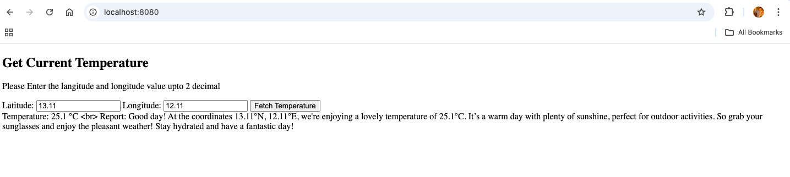

How to sucessfully run this code  
Through docker:  
    1. Turn on the docker in your local and Clone the repository and Go inside the weatherCheck folder  
    2. Generate the OpenAIKey and Update in the .env file or run the following command in the terminal to add the key as environment variable.  
        # OPENAI_API_KEY="Add you Key Here"  
        # export OPENAI_API_KEY="Add your Key Here"  
    3. Open the command line and run following  
        # docker compose build --no-cache  
        # docker compose up  
    4. Then goto the browser and use the local host "http://localhost:8080/"  
    5. Then Enter Latitude and longitude upto 2 decimal digit as it is coded to take upto 2 decimal.  
    |||Sample result|||  
    
    
    

To run app individually:    
    0. Turn on the docker in your local and Generate the OpenAIKey and Update in the .env file or run the following command in the terminal to add the key as environment variable.  
        # OPENAI_API_KEY="Add you Key Here"  
        # export OPENAI_API_KEY="Add your Key Here"
    1. First run the backend app by going inside the backend directory in cmd  
        # uvicorn app:app --reload --host 0.0.0.0 --port 8000  
    2. Validate if app is running perfectly  
        In browser- http://localhost:8000/weather?latitude=43.65&longitude=79.38  
        In cmd/postman - curl "http://localhost:8000/weather?latitude=43.65&longitude=79.38"  
    3. If you are getting the response successfully then goto the frontend directory and run the following command  
        # python -m http.server 8080  
    4. Now go to the localhost in browser http://localhost:8080/index.html  

        

