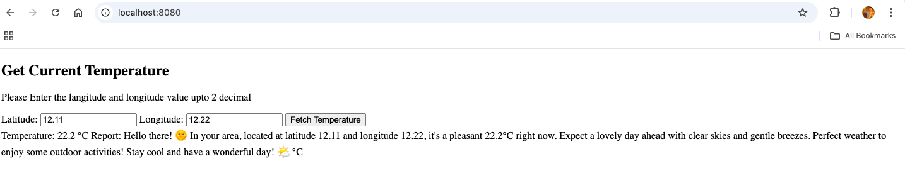
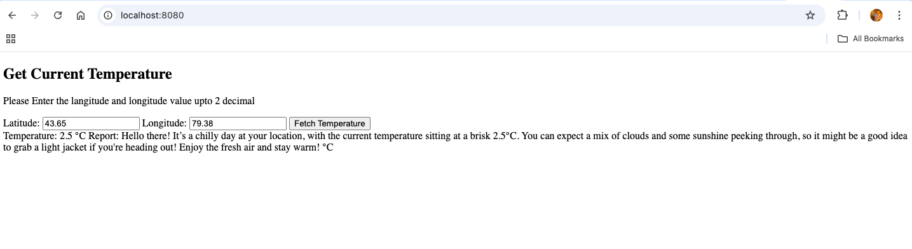

How to sucessfully run this code  
Through docker:  
    1. Clone the repository and Go inside the WEATHERCHECK folder  
    2. Open the command line and run following  
        # docker compose build  
        # docker compose run  
    3. Then goto the browser and use the local host "http://localhost:8080/"  
    4. Then Enter Latitude and longitude upto 2 decimal digit as it is coded to take upto 2 decimal. 
    |||Sample result|||  
    
    

To run app individually:    
    1. First run the backend app by going inside the backend directory in cmd  
        # uvicorn app:app --reload --host 0.0.0.0 --port 8000  
    2. Validate if app is running perfectly  
        In browser- http://localhost:8000/weather?latitude=43.65&longitude=79.38  
        In cmd/postman - curl "http://localhost:8000/weather?latitude=43.65&longitude=79.38"  
    3. If you are getting the response successfully then goto the frontend directory and run the following command  
        # python -m http.server 8080  
    4. Now go to the localhost in browser http://localhost:8080/index.html  

        

